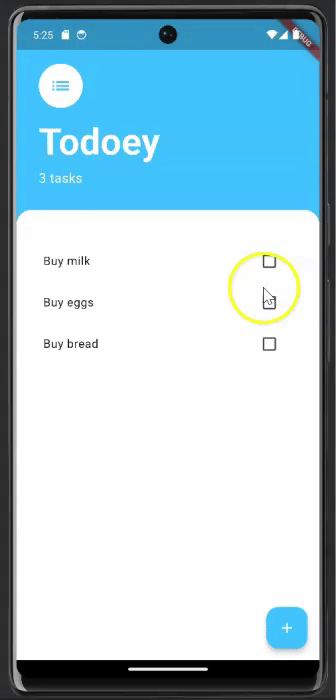

# Todoey Flutter

Todoey Flutter is a simple task list application designed to help users manage their daily tasks. This app is built with Flutter and leverages various features such as state management with the Provider package, OOP principles, and efficient UI components.

## Description

Todoey Flutter provides an intuitive task management experience. Users can add new tasks, mark them as complete, and delete them as needed. The app includes a user-friendly interface with a bottom sheet for adding tasks and a list builder for displaying tasks.

## Features

- **Task Management**: Add, complete, and delete tasks with ease.
- **State Management**: Efficient state management using the Provider package.
- **OOP Principles**: Application of Object-Oriented Programming concepts.
- **BottomSheet Widget**: Intuitive UI for adding new tasks using the BottomSheet widget.
- **List Builder**: Dynamic and efficient task list display using the ListView.builder.

## Demo

